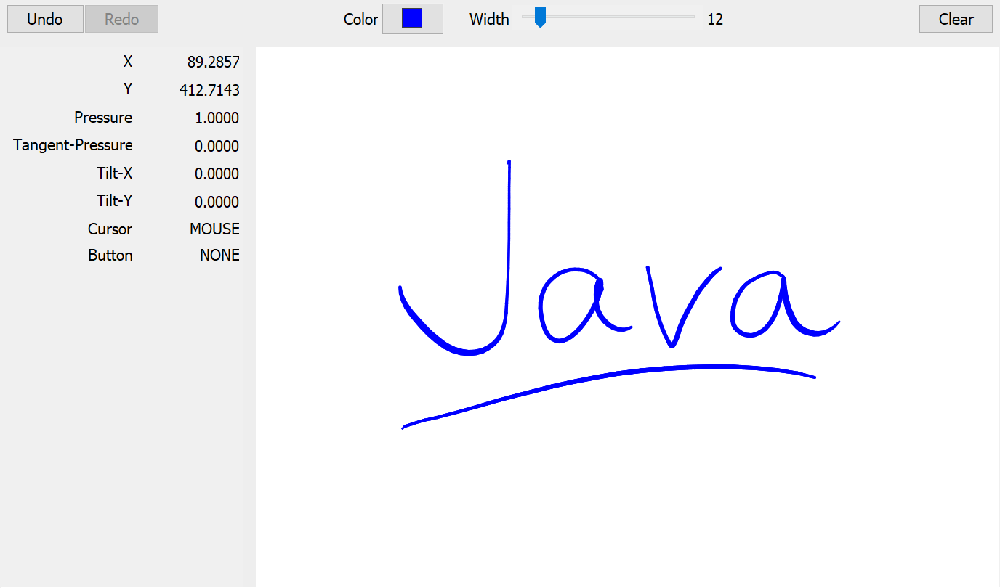
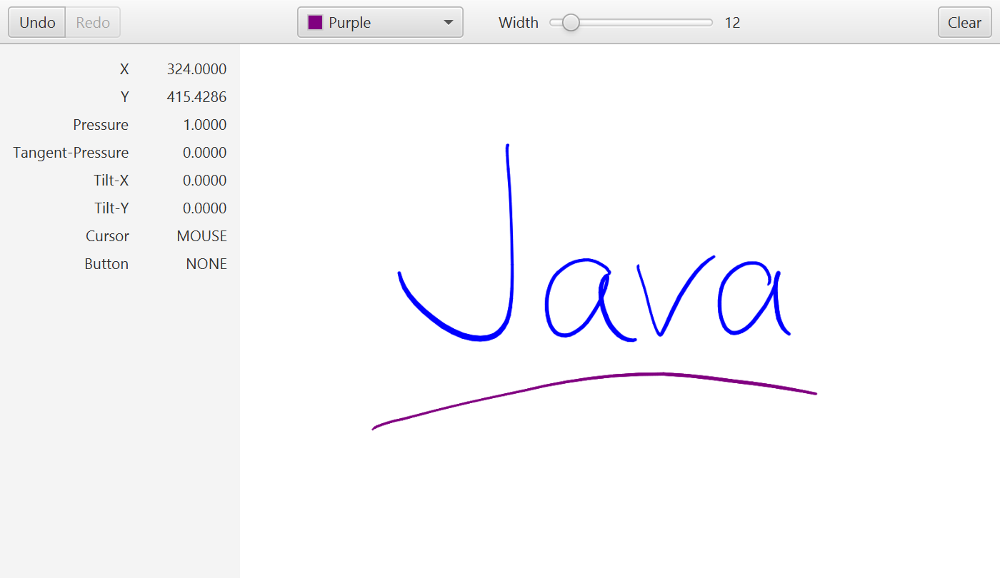

## Stylus pen input for Java

Java native interface implementation for pressure-sensitive input devices.

```xml
<dependency>
    <groupId>org.lecturestudio.stylus</groupId>
    <artifactId>stylus</artifactId>
    <version>0.1.0</version>
</dependency>
```

Swing                      |  JavaFX
:-------------------------:|:-------------------------:
  |  

### Supported Platforms
By default, the main artifact depends on the native library corresponding to the system you are running your build or application on.
The native libraries can be loaded on the following platforms:

| Operating System | Classifier          |
| ---------------- |---------------------|
| Linux            | linux-x86_64        |
| macOS            | macos-x86_64        |
| Windows          | windows-x86_64      |

### Build Notes

In order to build the native code, be sure to install the prerequisite software and libraries:

<table>
  <tr>
    <td>Linux</td>
    <td>gcc, g++, libstdc++, libX11-dev, libxi-dev (e.g. for Ubuntu, names may differ depending on your distro)</td>
  </tr>
  <tr>
    <td>macOS</td>
    <td>Xcode 9 or higher</td>
  </tr>
  <tr>
    <td>Windows</td>
    <td>Visual Studio 2017 or higher</td>
  </tr>
</table>

Assuming you have all the prerequisites installed for your OS, run:

```
mvn install
```

#### Troubleshooting

##### On Linux
If you get the error `/usr/bin/ld: cannot find -ljawt` while linking, perform following steps:
1. Find the path where JDK is installed: `which java` or `whereis java`.
   Exemplary output: `/usr/lib/jvm/java-16/bin/java`
2. Create a symbolic link to libjawt.so: `ln -s /usr/lib/jvm/java-16/lib/libjawt.so /usr/lib/` (according to the exemplary output above).
3. Build the project again.